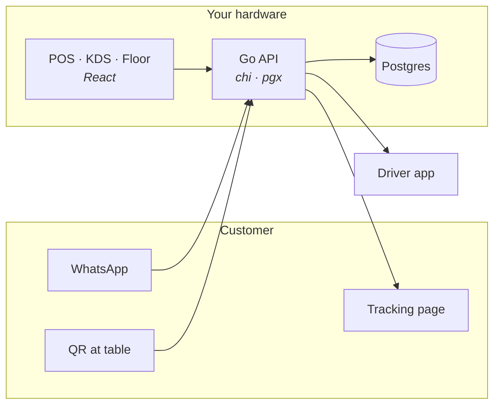

<div align="center">

# BeepBite

### A restaurant point-of-sale you actually own.

Front of house, kitchen, delivery and a **WhatsApp ordering channel** — one
system, running on your own hardware. No cloud account, no per-order fee, no
platform standing between you and your customers.

<sub>Part of <strong><a href="https://vulos.org">VulOS</a></strong> — the open, self-hostable web OS &amp; app suite. Runs standalone, or as an app hosted by the Vulos OS.</sub>

[](CHANGELOG.md)
[](LICENSE)
[](docs/setup.md)
[](#what-beepbite-is-not)
[](https://golang.org)
[](https://react.dev)

[**Quick start**](#quick-start) · [**Features**](#features) · [**How it works**](#how-it-works) · [**Status**](#status) · [**Docs**](docs/) · [**Roadmap**](ROADMAP.md)

<sub><em>Vulos — rooted in <strong>vula</strong>, the Zulu and Xhosa word for <strong>open</strong>.</em></sub>

</div>

---

## What is BeepBite?

A complete restaurant system: take the order, cook it, serve it, deliver it,
and know what it cost you. A Go API and a React app running against your own
Postgres — on a laptop in the back office, a machine in the cupboard, or a VM
you rent.

What makes it different is **who it belongs to**. Delivery platforms take
15–30% of every order and own the customer relationship. Cloud POS vendors
charge per terminal per month and hold your data hostage to a subscription.
BeepBite takes nothing and holds nothing, because there is no BeepBite service
— there is only the copy you run.

Its ordering channel is **WhatsApp**, which for most of the world is where
customers already are. Someone messages your number and orders in the app they
use all day: no download, no signup, no app-store listing to maintain.

> [!NOTE]
> **Status: pre-1.0 and under active rebuild.** The POS, kitchen, inventory and
> ordering surfaces are substantially built; several architectural changes are
> in flight. Read [Status](#status) for an honest per-area breakdown before
> deploying this anywhere real.

## Features

| Front of house | Kitchen &amp; stock |
|---|---|
| Touch POS — tabs, splits, voids, comps, manager approval | Kitchen display with per-station routing and expo |
| Floor plan and table management | Recipes, costing, and the 86 list |
| Customer-facing display | Suppliers, purchase orders, goods receipts |
| Reservations and waitlist | Invoice matching and waste tracking |
| Gift cards, store credit, house accounts | Stock counts and reorder suggestions |

| Money &amp; people | Ordering &amp; delivery |
|---|---|
| Cash drawer sessions and reconciliation | WhatsApp ordering bot |
| Tenders — cash, card, transfer, voucher | QR-at-table ordering |
| Promotions, coupons, loyalty | Delivery zones, driver app, live tracking |
| Invoicing and house-account billing | Pickup slots and order status |
| Time clock, payroll, tip pools | Public customer tracking page |

**Infrastructure you can trust**

- **Your database, your building.** Postgres you control. Nothing phones home,
  and a fresh install makes no outbound network calls at all.
- **No payment facilitator.** BeepBite records tenders; it never touches your
  money. "Card" means your own card machine on your own counter. No PCI scope,
  no settlement delay, no cut of your revenue.
- **Row-level security**, with tenant scoping enforced server-side from the
  authenticated identity — never from a filter the client supplies.
- **Audit log and idempotency keys** throughout, so a retried request can't
  double-charge.
- **Every integration is optional.** WhatsApp, maps and AI are each off unless
  you supply your own credentials.

## What BeepBite is not

- **Not a marketplace.** It will not bring you customers. It stops a
  marketplace from owning the ones you already have.
- **Not a payment processor.** It records what was tendered. Bring your own
  card machine and your own bank.
- **Not a hosted service.** No signup, no dashboard we operate, nobody to call.
  You run it, you back it up, you own the consequences.
- **Not finished.** See [Status](#status).

## Quick start

```bash
# 1. Database
createdb beepbite

# 2. Configure — set DATABASE_URL and JWT_SECRET
cp .env.example .env

# 3. Migrate
cd backend && go run ./cmd/migrate --env=local --up

# 4. API
go run ./cmd/server --env=local

# 5. App
cd .. && npm install && npm run dev        # http://localhost:5173
```

Want something to look at first?

```bash
cd backend && go run ./cmd/seeddemo        # demo restaurant with data
```

## How it works



Orders arrive from WhatsApp, a table QR code, or the till, and land in one
order stream. They route to the right kitchen station and, if they're going
out, to a driver — with a tracking link for the customer. Live updates are
server-sent events, so there is no polling and no message broker to operate.

## Configuration

| Variable | Default | Description |
|---|---|---|
| `DATABASE_URL` | — | Postgres connection string. **Required.** |
| `JWT_SECRET` | — | Signing key for access tokens. **Required.** |
| `PORT` | `8080` | API listen port |
| `WHATSAPP_TOKEN` | — | Meta Cloud API token. WhatsApp ordering stays off without it. |
| `WHATSAPP_PHONE_ID` | — | Meta phone number ID |
| `MAPBOX_TOKEN` | — | Delivery-zone geocoding. Optional. |

See [docs/setup.md](docs/setup.md) for the full list.

## Status

An honest per-area account, because a feature that silently does nothing is
worse than one that says it isn't built:

| Area | State |
|---|---|
| POS, KDS, floor plan, orders | **Built** — substantially complete, covered by integration and e2e tests |
| Inventory, purchasing, recipes | **Built** |
| Gift cards, loyalty, house accounts | **Built** |
| Delivery zones, driver, tracking | **Built**, but less exercised than the POS |
| WhatsApp ordering | **Built** — needs your own Meta credentials |
| Payments | **Tender recording only, by design.** Card processing was deliberately removed |
| Currency &amp; locale neutrality | **In progress.** Currency resolves per location; locale, tax and timezone assumptions are still being removed |
| Single binary + SQLite | **Planned, not done.** Postgres is required today |
| Offline-first sync between sites | **Designed, not implemented** |
| Screenshots | **Not yet** — the UI is mid-rebuild and anything captured now would be stale |

## Development

```bash
npm run dev              # frontend on :5173
npm run build            # production bundle
npm run test:unit        # vitest
npm run test:e2e         # playwright
cd backend && go test ./...
cd backend && go run ./cmd/tests     # integration + pentest suites
```

## Documentation

| Doc | |
|---|---|
| [Setup](docs/setup.md) | Install, configure, deploy |
| [User guide](docs/user-guide.md) | Running a service day to day |
| [Features](docs/features.md) | What each surface does |
| [API](docs/api.md) | HTTP contract |
| [Development](docs/development.md) | Working on the code |
| [Troubleshooting](docs/troubleshooting.md) | When it misbehaves |
| [Roadmap](ROADMAP.md) | Gap analysis and what's next |

## Contributing

Issues and pull requests welcome. Read [ROADMAP.md](ROADMAP.md) first — some
gaps are deliberate design choices and some are simply unbuilt, and the
difference matters.

## License

[MIT](LICENSE)

<div align="center">
<sub><strong>Built with purpose. Open by design.</strong></sub>
</div>
